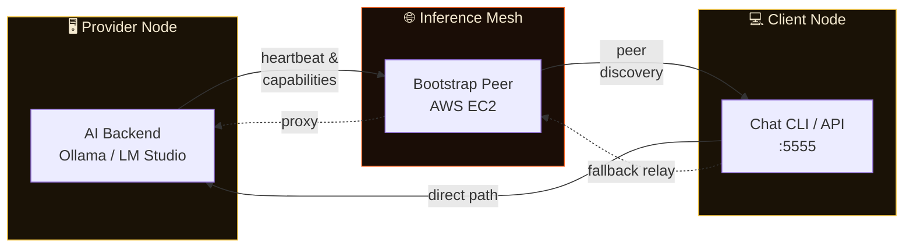

<p align="center">
  
</p>

<p align="center">
  <em>A local-first, peer-to-peer AI inference mesh.<br>Share GPU power. Run models anywhere. No cloud required.</em>
</p>

<p align="center">
  <a href="https://github.com/partha-mohapatra/GPUSwarm/actions/workflows/ci.yml"></a>
  <a href="https://github.com/partha-mohapatra/GPUSwarm/releases/latest"></a>
  <a href="https://github.com/partha-mohapatra/GPUSwarm/blob/main/LICENSE"></a>
  <a href="https://github.com/partha-mohapatra/GPUSwarm/stargazers"></a>
  <a href="https://github.com/partha-mohapatra/GPUSwarm/network/members"></a>
  <a href="https://golang.org"></a>
</p>

<p align="center">
  <a href="docs/infer_mesh_ai_architecture.md">📖 Architecture</a> ·
  <a href="docs/scaling_capacity.md">📈 Scaling</a> ·
  <a href="CONTRIBUTING.md">🤝 Contributing</a> ·
  <a href="https://github.com/partha-mohapatra/GPUSwarm/releases/latest">📦 Releases</a> ·
  <a href="deploy/aws/README.md">☁️ AWS Deploy</a>
</p>

---

## ✨ Features

<table>
  <tr>
    <td width="50%">

🔮 **Peer-to-Peer Inference**
Connect GPUs across machines with zero central server. Client discovers providers automatically via libp2p.

</td>
    <td width="50%">

⚡ **Streaming Responses**
End-to-end streaming from provider to client. Real-time token delivery for seamless AI conversations.

</td>
  </tr>
  <tr>
    <td width="50%">

🧠 **Multi-Backend Support**
Works with Ollama, LM Studio, or any OpenAI-compatible backend. Bring your own models.

</td>
    <td width="50%">

🌐 **NAT Traversal & Relay**
Built-in hole punching, port mapping, and relay fallback. Works across firewalls and NATs.

</td>
  </tr>
  <tr>
    <td width="50%">

🎯 **Smart Routing**
Auto, manual, prefer-known, or prefer-favorites routing policies. Sticky sessions, blocked/allowed peers.

</td>
    <td width="50%">

🖥️ **Interactive Chat CLI**
Full-featured terminal UI with model selection, peer browsing, routing control, and conversation history.

</td>
  </tr>
  <tr>
    <td width="50%">

🔒 **Zero-Config Security**
Identity-based peer authentication via libp2p. No API keys, no accounts, no sign-ups.

</td>
    <td width="50%">

📦 **Single Binary**
One binary (`infermeshd`) does it all — client, provider, or both. Cross-platform: Linux, macOS, Windows.

</td>
  </tr>
</table>

---

## 🚀 Quick Start

### Download

Grab the latest binary for your platform from [**Releases**](https://github.com/partha-mohapatra/GPUSwarm/releases/latest):

| Platform | Binary |
|----------|--------|
| 🐧 Linux x86_64 | `infermeshd-linux-amd64` |
| 🐧 Linux ARM64 | `infermeshd-linux-arm64` |
| 🍎 macOS Intel | `infermeshd-darwin-amd64` |
| 🍎 macOS Apple Silicon | `infermeshd-darwin-arm64` |
| 🪟 Windows x86_64 | `infermeshd-windows-amd64.exe` |

```bash
# Verify checksums
sha256sum -c SHA256SUMS
```

### Run

```bash
./infermeshd-linux-amd64
```

First launch starts an **interactive setup wizard** that asks only what's needed:

- **Mode**: `client` / `provider` / `both`
- **Node name**: your identity on the mesh
- **Backend** *(provider)*: Ollama, LM Studio, or manual endpoint
- **Models** *(provider)*: which models to expose

Config is saved to `~/.infermeshai/config.yaml` — subsequent launches reuse it automatically.

---

## 📖 Usage

### Provider Mode

Share your GPU with the swarm:

```bash
./infermeshd-linux-amd64 \
  -mode provider \
  -transport libp2p \
  -provider-name my-provider \
  -backend-kind ollama \
  -backend-url http://127.0.0.1:11434
```

> **Note:** Built-in defaults already target the EC2 bootstrap node, so you can omit bootstrap/rendezvous flags for quick testing.

### Client Mode

Connect to providers and run inference:

```bash
./infermeshd-linux-amd64 \
  -mode client \
  -transport libp2p \
  -client-name my-client \
  -client-addr :5555
```

### 💬 Chat CLI

Launch an interactive chat session:

```bash
./infermeshd-linux-amd64 chat -daemon-url http://127.0.0.1:5555
```

| Command | Description |
|---------|-------------|
| `/help` or `/` | Show all commands |
| `/status` | Connection & session info |
| `/models` | List available models |
| `/model [name\|#]` | Switch model |
| `/peers` | List mesh peers |
| `/use [peer_id\|#]` | Pin a specific provider |
| `/routing <policy>` | `auto` · `manual` · `prefer_known` · `prefer_favorites` |
| `/quit` | Exit chat |

📋 Full chat spec: [`docs/chat_cli_spec.md`](docs/chat_cli_spec.md)

---

## 🔌 APIs

### Client API (default `:5555`)

| Method | Endpoint | Description |
|--------|----------|-------------|
| `POST` | `/v1/chat/completions` | OpenAI-compatible inference |
| `GET` | `/v1/mesh/peers` | List discovered peers |
| `GET` | `/v1/mesh/routing` | Current routing policy |
| `PUT` | `/v1/mesh/routing` | Update routing policy |
| `POST` | `/v1/mesh/select/{peer_id}` | Pin a specific peer |

### Provider API (default `:7777`)

| Method | Endpoint | Description |
|--------|----------|-------------|
| `GET` | `/capabilities` | Exposed models & resources |

---

## 🔄 How It Works



1. **Connect** — Client and provider join the mesh via bootstrap peer(s)
2. **Advertise** — Provider broadcasts heartbeat & capabilities
3. **Discover** — Client discovers and ranks available providers
4. **Infer** — Direct path (`client → provider`) or relay fallback (`client → bootstrap → provider`)
5. **Stream** — Response tokens streamed end-to-end in real time

---

## ⚙️ Advanced Configuration

Config file at `~/.infermeshai/config.yaml` (YAML or JSON):

<details>
<summary><strong>🔧 All Configuration Flags</strong></summary>

| Category | Flags |
|----------|-------|
| **Transport / Discovery** | `-transport`, `-libp2p-bootstrap-peers`, `-libp2p-rendezvous`, `-libp2p-auto-relay`, `-libp2p-relay-service`, `-libp2p-nat-port-map`, `-libp2p-hole-punching` |
| **Routing Policy** | `-routing-policy`, `-favorite-peers`, `-blocked-peers`, `-allowed-peers`, `-sticky-peer-ttl` |
| **Provider Controls** | `-max-inflight`, `-rate-per-second`, `-burst`, `-max-tokens-per-request`, `-night-only`, `-idle-only`, `-pow-difficulty` |
| **Config Persistence** | `-config`, `-save-config` |

</details>

📐 Architecture deep-dive: [`docs/infer_mesh_ai_architecture.md`](docs/infer_mesh_ai_architecture.md)
📈 Scaling guide: [`docs/scaling_capacity.md`](docs/scaling_capacity.md)

---

## ☁️ AWS Bootstrap

Deploy your own bootstrap node on AWS:

```bash
# See deployment templates and scripts
cat deploy/aws/README.md
```

📄 Full instructions: [`deploy/aws/README.md`](deploy/aws/README.md)

---

## 🏗️ Build From Source

```bash
# Prerequisites: Go 1.21+

# Run tests
go test ./...

# Build all platform binaries
./scripts/build-all.sh
```

---

## 💖 Sponsors

GPUSwarm is free, open-source software. If you find it useful, consider supporting its development:

<p align="center">
  <a href="https://github.com/sponsors/partha-mohapatra">
    
  </a>
</p>

<table align="center">
  <tr>
    <th>🥇 Gold Sponsors</th>
    <th>🥈 Silver Sponsors</th>
    <th>🥉 Bronze Sponsors</th>
  </tr>
  <tr>
    <td align="center"><em>Your logo here</em></td>
    <td align="center"><em>Your logo here</em></td>
    <td align="center"><em>Your logo here</em></td>
  </tr>
</table>

---

## 🤝 Contributing

We ❤️ contributions! Whether it's bug reports, feature suggestions, documentation, or code — all are welcome.

- 📖 Read the [**Contributing Guide**](CONTRIBUTING.md)
- 🐛 [**Report a bug**](https://github.com/partha-mohapatra/GPUSwarm/issues/new)
- 💡 [**Request a feature**](https://github.com/partha-mohapatra/GPUSwarm/issues/new)

---

## 👥 Contributors

<p align="center">
  <a href="https://github.com/partha-mohapatra/GPUSwarm/graphs/contributors">
    
  </a>
</p>

<p align="center">
  <em>Made with <a href="https://contrib.rocks">contrib.rocks</a></em>
</p>

---

## ⭐ Star History

<p align="center">
  <a href="https://www.star-history.com/#partha-mohapatra/GPUSwarm&Date">
    
  </a>
</p>

---

## 📄 License

<p align="center">
  <a href="LICENSE"></a>
</p>

<p align="center">
  Licensed under the <a href="LICENSE">Apache License 2.0</a> — free to use, modify, and distribute.
</p>

---

<p align="center">
  
  <br>
  <strong>Inference for All. Powered by the Swarm. 🐝</strong>
  <br>
  <sub>Built with ❤️ by <a href="https://github.com/partha-mohapatra">Partha Mohapatra</a> and the community</sub>
</p>
